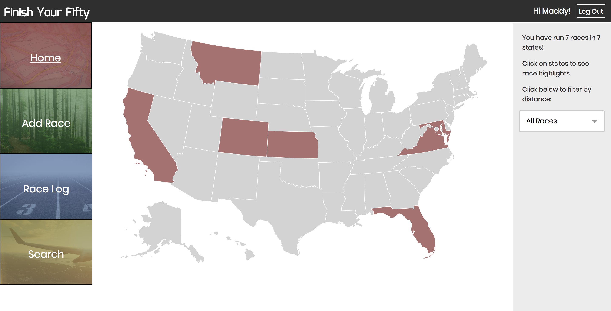

Finish-Your-Fifty-Database

Finish Your Fifty is an application for runners with the goal to run a race in every state. The app provides a way for these users to easily see which states have been completed and search races in states that have not yet been completed. The user can add races manually or using search results, and can see a race log with all race information.

The frontend was built with React, Redux and React Router and the backend was built with Express and Knex.

Backend: https://github.com/mmdberg/Finish-Your-Fifty

